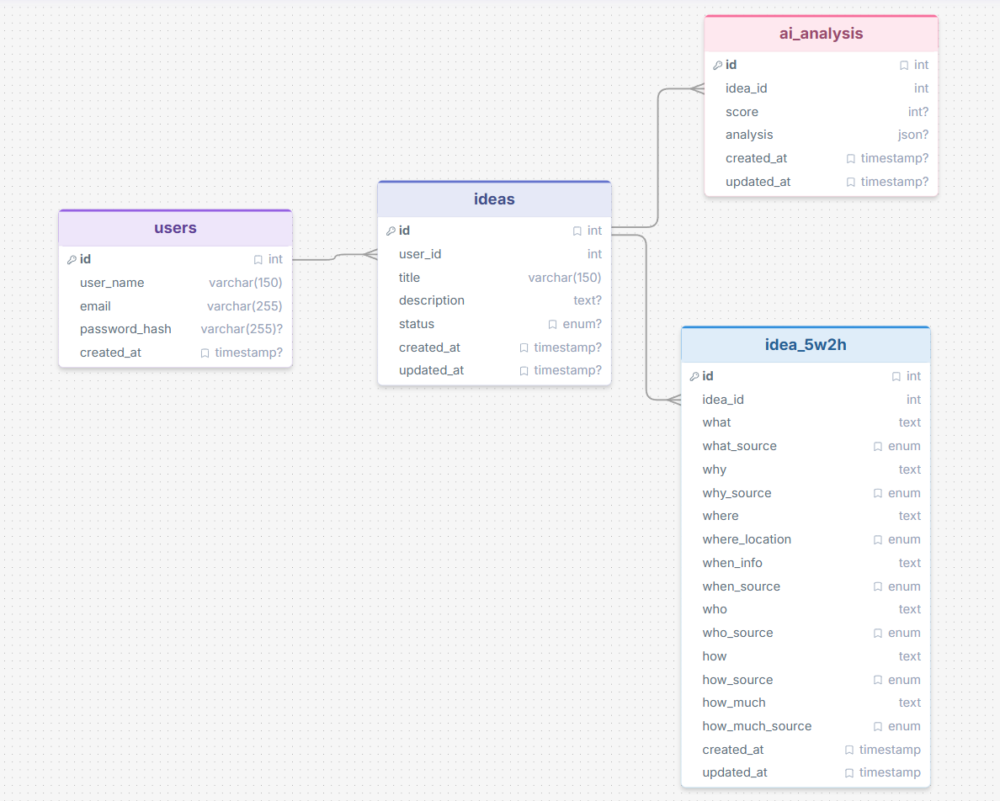

# Database

## Banco de dados

O projeto utiliza **MySQL** para persistência dos dados.

A modelagem foi planejada para separar as principais entidades da aplicação, garantindo integridade referencial e flexibilidade para o armazenamento de relatórios gerados por Inteligência Artificial.

## DER



<details>
<summary>🔍 Clique para ver a versão simplificada em texto (ASCII)</summary>

```text
┌─────────────────┐
│      users      │
├─────────────────┤
│ PK id           │
│ name            │
│ email           │
│ password_hash   │
│ created_at      │
└────────┬────────┘
         │ 1
         │
         │ N
┌────────▼────────┐
│      ideas      │
├─────────────────┤
│ PK id           │
│ FK user_id      │
│ title           │
│ description     │
│ category        │
│ status          │
│ created_at      │
│ updated_at      │
└───────┬─────┬───┘
        │1    │1
        │     │
        │     │N
        │     ▼
        │ ┌─────────────────────────┐
        │ │       ai_analysis       │
        │ ├─────────────────────────┤
        │ │ PK id                   │
        │ │ FK idea_id              │
        │ │ score                   │
        │ │ analysis_data (JSON)    │
        │ │ created_at              │
        │ └─────────────────────────┘
        │
        │1
        │
        │1
┌───────▼────────────────┐
│       idea_5w2h        │
├────────────────────────┤
│ PK id                  │
│ FK idea_id             │
│                        │
│ what                   │
│ what_source            │
│ why                    │
│ why_source             │
│ where_location         │
│ where_location_source  │
│ when_info              │
│ when_source            │
│ who                    │
│ who_source             │
│ how                    │
│ how_source             │
│ how_much               │
│ how_much_source        │
│ created_at             │
│ updated_at             │
└────────────────────────┘
```
</details>

### Principais entidades

#### `users`

Armazena os usuários da aplicação e prepara a estrutura para autenticação futura.

#### `ideas`

Armazena as ideias criadas pelos usuários, incluindo título, descrição, categoria, status e datas de criação/atualização.

#### `idea_5w2h`

Armazena o planejamento 5W2H relacionado à ideia.

#### `ai_analysis`

Armazena informações relacionadas às análises geradas pela IA, incluindo conteúdo estruturado em JSON.

### Modelagem híbrida

As respostas da IA podem evoluir conforme os prompts e as funcionalidades do sistema também evoluem.

Por isso, o projeto utiliza uma abordagem híbrida:

- **Dados relacionais** para informações estruturadas e previsíveis.
- **JSON** para conteúdos de IA que podem possuir estruturas variáveis.

Essa abordagem busca reduzir a necessidade de alterações frequentes no esquema do banco conforme novas seções de análise forem adicionadas.

## Modelagem de dados
O OlivIA Ideas foi projetado para permitir a evolução dos prompts de IA sem exigir alterações frequentes no banco de dados.

Os dados fundamentais da aplicação (usuários, ideias e planejamento 5W2H) são armazenados em estruturas relacionais tradicionais.

Já os resultados das análises de IA utilizam uma abordagem híbrida:
- Campos críticos e frequentemente consultados são armazenados de forma estruturada.
- Informações variáveis e dependentes da versão do prompt são armazenadas em formato JSON.

Essa abordagem permite adicionar novas seções de análise futuramente sem a necessidade de migrações constantes no banco de dados.
