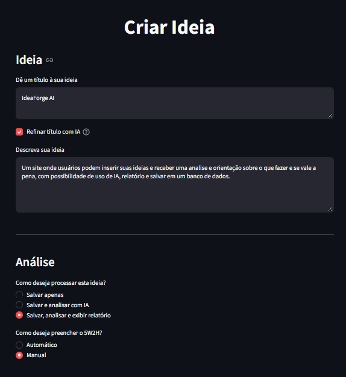
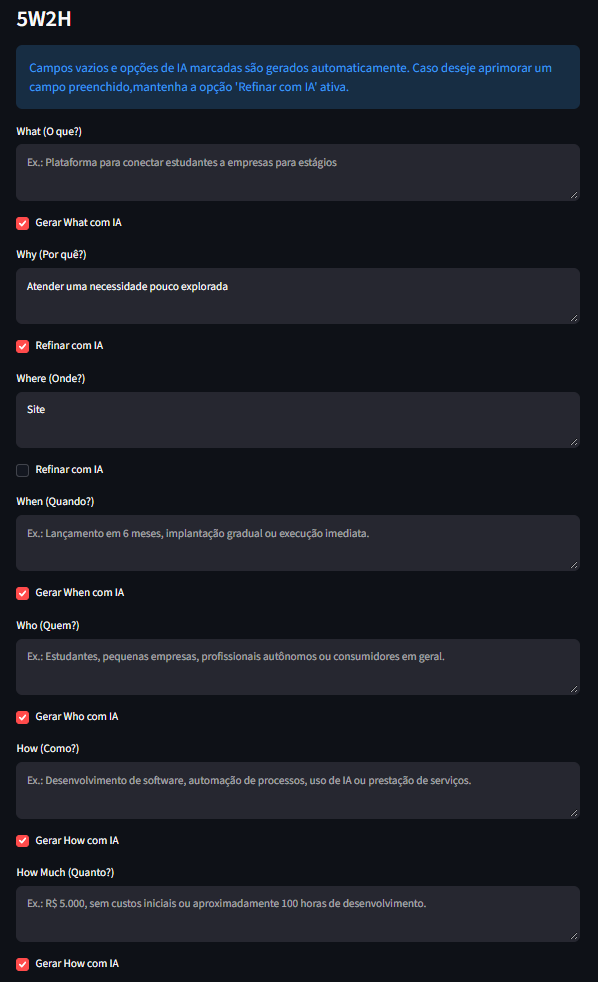
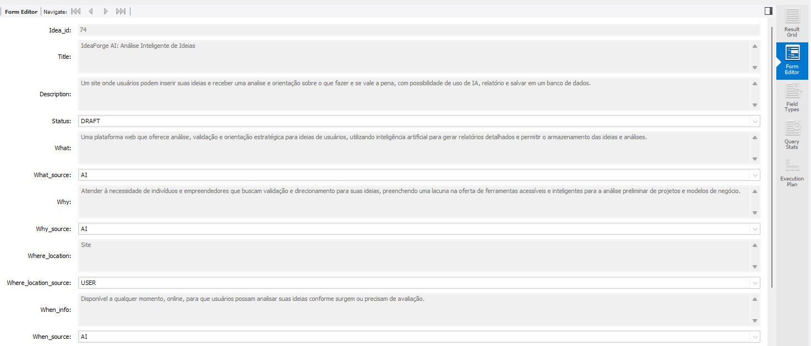
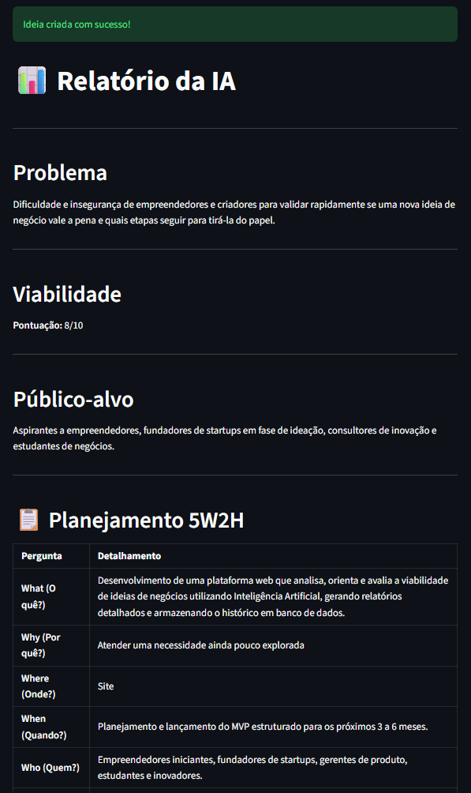

# Demonstração do Fluxo Create + IA

## Objetivo

Este guia descreve o fluxo ativo de criação: coleta de informações, opções de IA, persistência do 5W2H e exibição opcional da análise. Para responsabilidades das camadas, consulte [architecture.md](architecture.md).

## Pré-requisitos

1. MySQL configurado com `backend/database/schema.sql`.
2. `DB_HOST`, `DB_PORT`, `DB_USER`, `DB_PASSWORD` e `DB_NAME` em `.env`.
3. `GEMINI_API_KEY` configurada para operações de IA.
4. Aplicação iniciada com `streamlit run app.py`.

## Cenário 1 — Salvar uma ideia manualmente

1. Abra **Criar ideia**.
2. Informe título e descrição.
3. Selecione **Salvar apenas**.
4. Escolha preenchimento manual do 5W2H e informe os campos desejados.
5. Clique em **Criar ideia**.

> Para fins de demonstração, os exemplos utilizam o próprio OlivIA Ideas como ideia analisada pelo sistema.



O backend valida o payload e grava `ideas` e `idea_5w2h` na mesma transação. Os campos 5W2H informados manualmente e  preservados recebem origem `USER`. Esse cenário não chama Gemini nem requer chave de IA.

## Cenário 2 — Gerar 5W2H e análise com IA

1. Informe uma descrição suficientemente específica.
2. Deixe o título vazio e mantenha **Gerar título com IA**, ou informe título e escolha **Refinar com IA**.
3. Selecione preenchimento **Automático** para 5W2H.
4. Selecione **Salvar, analisar e exibir relatório**.
5. Clique em **Criar ideia**.

`PromptService` compõe uma solicitação única. `AIService` chama Gemini, `AIResponseParser` valida o JSON e `IdeaService` persiste título, 5W2H e análise. Os sete campos 5W2H recebem origem `AI`; o relatório é exibido em Markdown.

## Cenário 3 — Refinar campos específicos

1. Selecione preenchimento **Manual**.
2. Preencha os campos que deseja preservar ou revisar.
3. Marque **Refinar com IA** somente nos campos desejados.
4. Escolha uma modalidade de análise e envie.



Somente campos selecionados são atualizados pela resposta da IA. No banco, campos gerados e refinados recebem `AI`; campos preservados recebem `USER`.

## Resultado esperado no banco

Após sucesso, existe uma linha em `ideas` e outra em `idea_5w2h`. Quando análise é solicitada, existe também uma linha em `ai_analysis`.

```sql
SELECT
    i.id AS idea_id,
    i.title,
    i.description,
    i.status,
    w.what,
    w.what_source,
    w.why,
    w.why_source,
    w.where_location,
    w.where_location_source,
    w.when_info,
    w.when_source
FROM ideas i
LEFT JOIN idea_5w2h w
    ON w.idea_id = i.id
WHERE i.id = 74
```



## Resultado no relatório
Quando a opção de análise e exibição do relatório é selecionada, o resultado é apresentado em Markdown, incluindo os dados da ideia, a análise gerada e o 5W2H.



## Observabilidade e falhas

- Erros de validação, API ou persistência resultam em feedback seguro na interface.
- Detalhes técnicos são registrados em `logs/app.log` por logging estruturado.
- Chave Gemini, senha de banco e outros segredos não devem aparecer nos logs.
- Falhas transitórias da API podem acionar o modelo de fallback configurado.

Consulte [database.md](database.md) para nomes e significado de colunas.
